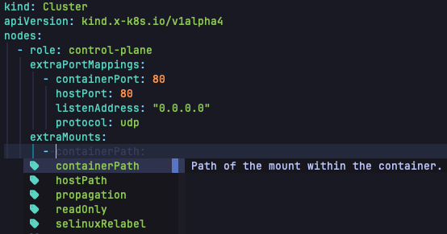
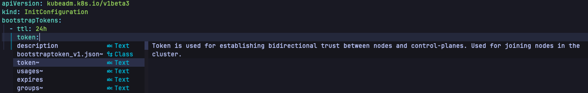
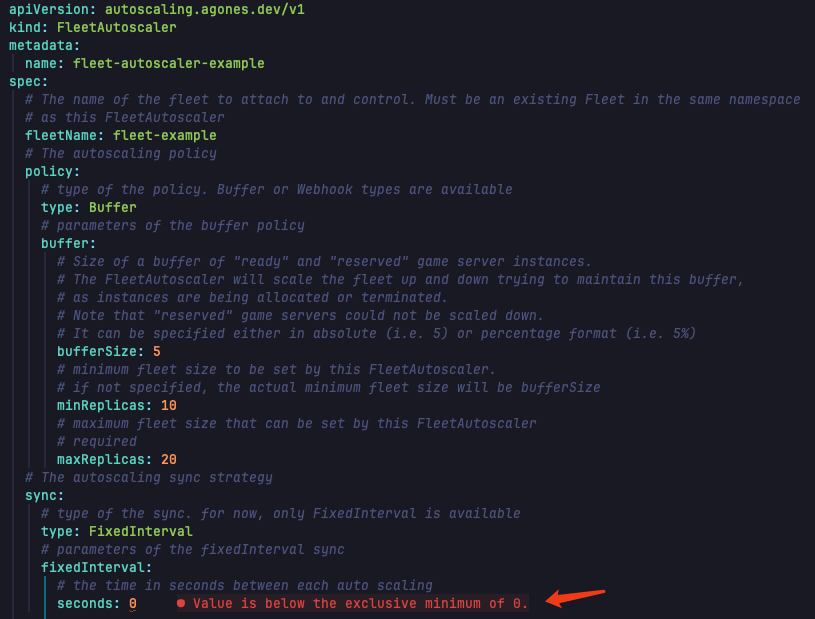

# kubeschema.nvim

Kubernetes Schema Support for Neovim, Schema is Powered by [kubeschema](https://github.com/imroc/kubeschema) and [kubeschemas](https://github.com/imroc/kubeschemas).

All kubenretes builtin resource types, a lot of well knowns CRDs and kubernetes related configuration file schemas are supported out of the box (about 1500 types), and can be flexibly extended with more customized schemas.


## Screenshots

Auto completion with kubernetes resources:


Auto completion with kubernetes custom resources:


Auto completion with kubeconfig:


Auto completion with [kind](https://kind.sigs.k8s.io/docs/user/configuration/) configuration:



Auto completion with [kubeadm](https://kubernetes.io/docs/reference/config-api/kubeadm-config.v1beta3/) configuration:



Validation:



Hover over the field to expand the explanation (usually press `K`):


## Installation

[neovim/nvim-lspconfig](https://github.com/neovim/nvim-lspconfig) MUST be installed, and `yamlls`'s `on_attach` MUST call `kubernetes.nvim`'s `on_attach` function.

Install the plugin with your package manager.

Use [lazy.nvim](https://github.com/folke/lazy.nvim):

```lua
{
  "neovim/nvim-lspconfig",
  dependencies = {
    {
      "imroc/kubeschema.nvim",
      opts = {
        schema = { -- default schema
          url = "https://github.com/imroc/kubeschemas",
          dir = vim.fn.stdpath("data") .. "/kubernetes/schemas",
        },
        extra_schema = { -- extra schema, mainly your own crd
          url = "",
          dir = vim.fn.stdpath("data") .. "/kubernetes/extra_schemas", -- extra schema dir, `KubeSchemaDump` command will dump json schema to this dir, and have higher priority in schema match
        },
        ignore_file_patterns = { -- ignore file patterns, can be used to avoid conflict with other schemas (e.g. SchemaStore.nvim)
          [[kustomization\.ya?ml$]],
          [[k3d\.ya?ml$]],
        }
      }
    }
  },
  opts = {
    servers = {
      yamlls = {
        on_attach = function(client, bufnr)
          -- lazy load on_attach in kubernetes.nvim
          require("kubernetes").on_attach(client, bufnr)
          -- you can add other customized on_attach logic below if you want
        end,
      }
    }
  }
}
```

Or

```lua
{
  "neovim/nvim-lspconfig",
  dependencies = {
    {
      "imroc/kubeschema.nvim",
      opts = {
        schema = { -- default schema
          url = "https://github.com/imroc/kubeschemas",
          dir = vim.fn.stdpath("data") .. "/kubernetes/schemas",
        },
        extra_schema = { -- extra schema, mainly your own crd
          url = "",
          dir = vim.fn.stdpath("data") .. "/kubernetes/extra_schemas", -- extra schema dir, `KubeSchemaDump` command will dump json schema to this dir, and have higher priority in schema match
        },
        ignore_file_patterns = { -- ignore file patterns, can be used to avoid conflict with other schemas (e.g. SchemaStore.nvim)
          [[kustomization\.ya?ml$]],
          [[k3d\.ya?ml$]],
        }
      }
    }
  },
  opts = function(_, opts)
    opts.servers = vim.tbl_deep_extend("force", opts.servers or {}, {
      yamlls = {
        -- the opts function is already lazy loaded, so we can directly assign the on_attach function here if no other custom logic needed
        on_attach = require("kubernetes").on_attach
      }
    })
  end
}
```

##  Configuration

Default configuration:

```lua
{
  schema = { -- default schema
    url = "https://github.com/imroc/kubeschemas",
    dir = vim.fn.stdpath("data") .. "/kubernetes/schemas",
  },
  extra_schema = { -- extra schema, mainly your own crd
    url = "",
    dir = vim.fn.stdpath("data") .. "/kubernetes/extra_schemas", -- extra schema dir, `KubeSchemaDump` command will dump json schema to this dir, and have higher priority in schema match
  },
	ignore_file_patterns = { -- ignore file patterns, can be used to avoid conflict with other schemas (e.g. SchemaStore.nvim)
		[[kustomization\.ya?ml$]],
		[[k3d\.ya?ml$]],
	}
}
```

## Command

- `KubeSchemaDump`: Dump kubernetes json schema from current cluster to add extra schemas (Require [kubectl](https://kubernetes.io/docs/tasks/tools/#kubectl) and [kubeschema](https://github.com/imroc/kubeschema) installed and can operate the current cluster).
- `KubeSchemaUpdate`: Update kubernetes json schema from remote git repo (Require `git` installed, default remote git repo is [kubeschemas](https://github.com/imroc/kubeschemas)).

## How it works

Dynamically parse the `kind` and `apiVersion` fields in the YAML file content to locate the corresponding JSON schema file and pass it to `yamlls`, thereby enabling automatic completion, validation, and field explanation hints for Kubernetes YAML.

This approach has the following advantages:
1. **High performance**. Precise matching of small JSON schemas means yamlls does not need to traverse all the schemas during matching.
2. **Extremely extensible**. Each kubernetes resource type have a corresponding json schema file, one subdirectory per group, allowing for unlimited expansion of additional kubernetes resource types.
